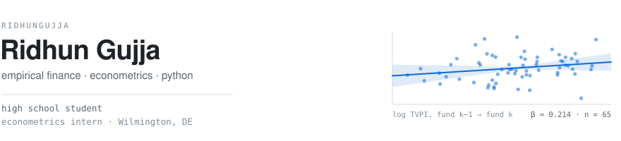
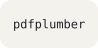
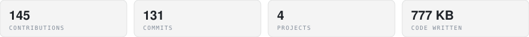
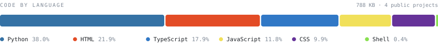

<picture>
  <source media="(prefers-color-scheme: dark)" srcset="assets/banner-dark.svg">
  
</picture>

<picture>
  <source media="(prefers-color-scheme: dark)" srcset="https://raw.githubusercontent.com/ridhungujja/ridhungujja/clock-output/clock-dark.svg">
  
</picture>

I'm a high school student working on empirical finance questions — mostly the kind
where the interesting part is the identification, not the model. I write Python for
research and TypeScript for the things I wish existed.

## Currently

- Building **[Podium](https://github.com/ridhungujja/podium)** — instant judge-style feedback on extemp speeches
- Finishing the writeup for **[PE Firm Persistence](https://github.com/ridhungujja/pe-firm-persistence)**, on whether private equity returns carry across funds
- Running my **ISEF project**: a 4×5 factorial study of whether *how a prompt is phrased* — neutral, urgent, authority-appealing, or emotionally loaded — changes how often a language model hallucinates, holding the actual question constant across five models with different alignment regimes
- Open to research assistant work in empirical finance or econometrics

## Selected work

### [PE Firm Persistence](https://github.com/ridhungujja/pe-firm-persistence) · Python

Do good private equity funds predict good successors? Pension funds allocate billions
on the assumption that they do. I test it on CalPERS' legally-mandated quarterly
disclosures — 462 published rows down to 65 mature, adjacent fund pairs — regressing
log TVPI on the predecessor fund's, with vintage fixed effects and errors clustered
on the fund family.

```
β = 0.214    SE 0.138    95% CI [−0.057, 0.485]
p = 0.121    wild cluster bootstrap p = 0.187    n = 65
```

The interval contains zero. On this data, persistence can't be told apart from luck —
and the sample dies at 65 pairs for reasons worth more than the coefficient.

### [Forma](https://github.com/ridhungujja/forma) · JavaScript

A Chrome extension that restructures PDFs, DOCX and slide decks into clean Markdown
*before* they upload to Claude. Claude's native PDF pipeline renders every page as an
image as well as extracting its text, so a large share of the token cost is a vision
tax that a clean text upload never pays. Forma removes it locally — no document
content ever leaves the browser tab.

### [Podium](https://github.com/ridhungujja/podium) · TypeScript

Draw a question, prep, speak, get structured feedback on structure, content and
delivery in under a minute. Built for high school extempers without a coach.
Next.js 14 · Tailwind · Framer Motion.

## Stack

**Languages**

<a href="https://www.python.org" title="Python"><picture><source media="(prefers-color-scheme: dark)" srcset="assets/tiles/python-dark.svg"></picture></a><a href="https://www.r-project.org" title="R"><picture><source media="(prefers-color-scheme: dark)" srcset="assets/tiles/r-dark.svg"></picture></a><a href="https://www.postgresql.org" title="SQL"><picture><source media="(prefers-color-scheme: dark)" srcset="assets/tiles/sql-dark.svg"></picture></a><a href="https://www.latex-project.org" title="LaTeX"><picture><source media="(prefers-color-scheme: dark)" srcset="assets/tiles/latex-dark.svg"></picture></a><a href="https://developer.mozilla.org/en-US/docs/Web/JavaScript" title="JavaScript"></a><a href="https://developer.mozilla.org/en-US/docs/Web/HTML" title="HTML"></a><a href="https://developer.mozilla.org/en-US/docs/Web/CSS" title="CSS"></a><a href="https://www.gnu.org/software/bash/" title="Bash"><picture><source media="(prefers-color-scheme: dark)" srcset="assets/tiles/bash-dark.svg"></picture></a>

**Libraries**

<a href="https://pandas.pydata.org" title="pandas"></a><a href="https://numpy.org" title="NumPy"></a><a href="https://www.statsmodels.org" title="statsmodels"></a><a href="https://scipy.org" title="SciPy"></a><a href="https://matplotlib.org" title="Matplotlib"></a><a href="https://react.dev" title="React"><picture><source media="(prefers-color-scheme: dark)" srcset="assets/tiles/react-dark.svg"></picture></a><a href="https://nextjs.org" title="Next.js"><picture><source media="(prefers-color-scheme: dark)" srcset="assets/tiles/next-js-dark.svg"></picture></a>

**Software &amp; Tools**

<a href="https://www.stata.com" title="Stata"></a><a href="https://git-scm.com" title="Git"></a><a href="https://github.com/ridhungujja" title="GitHub"><picture><source media="(prefers-color-scheme: dark)" srcset="assets/tiles/github-dark.svg"></picture></a><a href="https://claude.com/claude-code" title="Claude Code"></a><a href="https://docs.pytest.org" title="pytest"></a><a href="https://github.com/jsvine/pdfplumber" title="pdfplumber"></a>

## By the numbers

<picture>
  <source media="(prefers-color-scheme: dark)" srcset="assets/activity-dark.svg">
  
</picture>

<picture>
  <source media="(prefers-color-scheme: dark)" srcset="assets/langs-dark.svg">
  
</picture>

## On repeat

<a href="https://open.spotify.com/track/1zzejMGRYKP5XOa3FmzXfa"><picture><source media="(prefers-color-scheme: dark)" srcset="assets/spotify-1-dark.svg"></picture></a><a href="https://open.spotify.com/track/7H7NyZ3G075GqPx2evsfeb"><picture><source media="(prefers-color-scheme: dark)" srcset="assets/spotify-2-dark.svg"></picture></a>

<sub>Covers and titles pulled from Spotify · out of <a href="https://open.spotify.com/playlist/0v23S8pWmoUcxv1chc8kzh">cash curious 💰💸</a></sub>

## Elsewhere

<a href="mailto:ridhung@gmail.com" title="Gmail"><picture><source media="(prefers-color-scheme: dark)" srcset="assets/tiles/gmail-dark.svg"></picture></a><a href="https://github.com/ridhungujja" title="GitHub"><picture><source media="(prefers-color-scheme: dark)" srcset="assets/tiles/github-dark.svg"></picture></a><a href="https://www.linkedin.com/in/ridhungujja/" title="LinkedIn"></a><a href="https://www.instagram.com/ridhungujja/" title="Instagram"></a><a href="https://open.spotify.com/playlist/0v23S8pWmoUcxv1chc8kzh" title="Spotify"><picture><source media="(prefers-color-scheme: dark)" srcset="assets/tiles/spotify-dark.svg"></picture></a>

<a href="https://www.buymeacoffee.com/ridhungujja">
  
</a>
