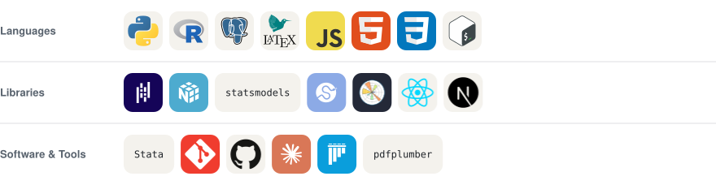

<picture>
  <source media="(prefers-color-scheme: dark)" srcset="assets/banner-dark.svg">
  
</picture>

<picture>
  <source media="(prefers-color-scheme: dark)" srcset="assets/clock-dark.svg">
  
</picture>

I'm a high school student working on empirical finance questions — mostly the kind
where the interesting part is the identification, not the model. I write Python for
research and TypeScript for the things I wish existed.

## Currently

- Building **[Podium](https://github.com/ridhungujja/podium)** — instant judge-style feedback on extemp speeches
- Finishing the writeup for **[pe-firm-persistence](https://github.com/ridhungujja/pe-firm-persistence)**, on whether private equity returns carry across funds
- Working through panel methods and cluster-robust inference
- Open to research assistant work in empirical finance or econometrics

## Selected work

### [pe-firm-persistence](https://github.com/ridhungujja/pe-firm-persistence) · Python

Do good private equity funds predict good successors? Pension funds allocate billions
on the assumption that they do. I test it on CalPERS' legally-mandated quarterly
disclosures — 462 published rows down to 65 mature, adjacent fund pairs — regressing
log TVPI on the predecessor fund's, with vintage fixed effects and errors clustered
on the fund family.

```
β = 0.214    SE 0.138    95% CI [−0.057, 0.485]
p = 0.121    wild cluster bootstrap p = 0.187    n = 65
```

The interval contains zero. On this data, persistence can't be told apart from luck —
and the sample dies at 65 pairs for reasons worth more than the coefficient.

### [forma](https://github.com/ridhungujja/forma) · JavaScript

A Chrome extension that restructures PDFs, DOCX and slide decks into clean Markdown
*before* they upload to Claude. Claude's native PDF pipeline renders every page as an
image as well as extracting its text, so a large share of the token cost is a vision
tax that a clean text upload never pays. Forma removes it locally — no document
content ever leaves the browser tab.

### [podium](https://github.com/ridhungujja/podium) · TypeScript

Draw a question, prep, speak, get structured feedback on structure, content and
delivery in under a minute. Built for high school extempers without a coach.
Next.js 14 · Tailwind · Framer Motion.

## Stack

<picture>
  <source media="(prefers-color-scheme: dark)" srcset="assets/stack-dark.svg">
  
</picture>

## By the numbers

<picture>
  <source media="(prefers-color-scheme: dark)" srcset="assets/activity-dark.svg">
  
</picture>

<picture>
  <source media="(prefers-color-scheme: dark)" srcset="assets/langs-dark.svg">
  
</picture>

<picture>
  <source media="(prefers-color-scheme: dark)" srcset="https://raw.githubusercontent.com/ridhungujja/ridhungujja/snake-output/github-snake-dark.svg">
  
</picture>

## Elsewhere

[](mailto:ridhung@gmail.com)
[](https://github.com/ridhungujja)

<a href="https://www.buymeacoffee.com/ridhungujja">
  
</a>

<sub>Every figure here is drawn from real data and redrawn on a schedule —
<code>assets/make_assets.py</code>. The clock is stamped when that workflow last ran.</sub>
